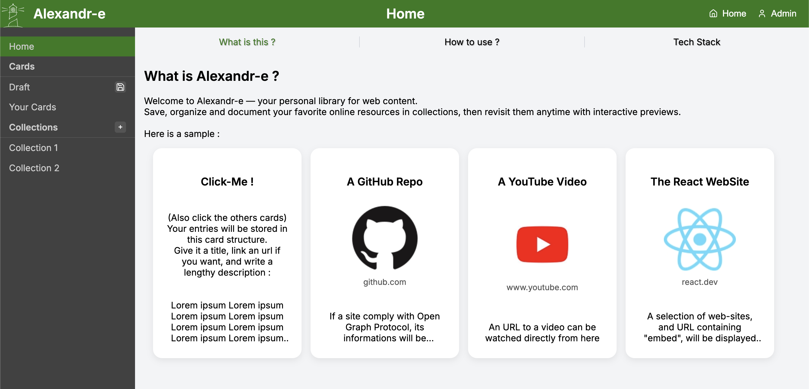

# Alexandr-e Front End

Application de marque-page URL.
Les utilisateurs peuvent créer des cartes contenant titre, description et URL, ainsi que des collections servant à organiser ces cartes. Si une URL est fournie à la carte, l'application tentera d'afficher une preview de l'URL : ReactPlayer, iFrame ou OpenGraph tags.

Application frontend réalisée avec **React**, **TypeScript** et **Vite**.

## Aperçu



Démo : [https://alexandr-e.vercel.app/](https://alexandr-e.vercel.app/)

## Stack technique

### Frontend

- React (SPA)
- TypeScript
- Vite (build tool / dev server)
- React Router (navigation)

### Communication API

- API REST
- Fetch
- Gestion des appels via hooks personnalisés

### State management

- Hooks custom pour logique métier

### UI / UX

- CSS responsive
- Gestion des previews d’URL (OpenGraph / iframe / ReactPlayer)

### Qualité & tooling

- ESLint
- Prettier
- Volta (versioning Node/Yarn)

## Architecture

Le projet suit une organisation simple et pragmatique, structurée par responsabilité afin de garder le code lisible et maintenable.

- `public/` : fichiers publics (favicon)
- `src/api/` : couche d’accès au backend (requêtes API)
- `src/assets/` : ressources statiques (images, etc.)
- `src/components/` : composants UI
- `src/css/` : feuilles de styles
- `src/hooks/` : logique réutilisable et gestion des contextes
- `src/utils/` : fonctions utilitaires
- `src/config.ts/` : configuration
- `src/App.tsx` : composant principal
- `src/Routes.tsx` : routing de l’application

## Fonctionnalités importantes

- Authentification utilisateur
- CRUD de cartes
- CRUD de collections
- CRUD utilisateur
- Draft cards en local : les utilisateurs peuvent créer des cartes qui seront sauvegardées tant que le localStorage contient les données de cartes
- Mise en cache des logo des sites
- Responsive mobile

## Installation

### Pré-requis

- [Volta](https://volta.sh/) installé

Les versions de Node.js et Yarn sont automatiquement gérées via Volta.

### Variable d'environement

(optionnel) Créer un fichier `.env.dev.lan` pour le mode dev:lan

```env
VITE_API_BASE_URL=<IP Réseau du back>
```

### Backend associé

Repo GitHub : [https://github.com/cknoe/FrontendReact](https://github.com/cknoe/FrontendReact)

### Installation

```sh
yarn install
```

## Démarrage

### En local

```sh
yarn dev
```

Accède à l’application sur [http://localhost:5173](http://localhost:5173).

### En LAN (nécessite .env.dev.lan)

```sh
yarn dev:host
```

## Scripts

- `yarn dev` : Lance le serveur de développement
- `yarn build` : Build de production
- `yarn preview` : Prévisualisation du build
- `yarn lint` : Vérifie la qualité du code avec ESLint
- `yarn format` : Formate le code avec Prettier
